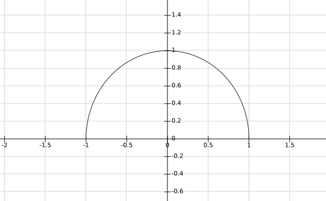
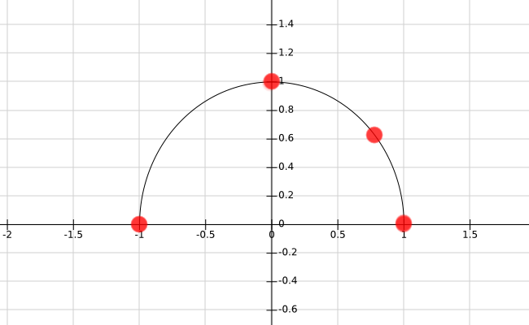
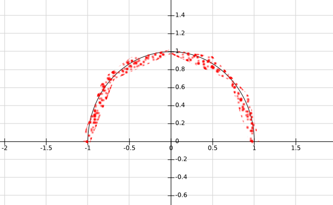

# Property Based Testing

by That TDD Fellow

@waterlink000


## Goal of this talk


### Write less tests

- less maintenance **AND**
- more test coverage


### Find all the bugs


### Think harder about the problem


## What Property Based Testing is?


### Generic assertions about System Under Test

**Generic** word is important


### Generators

**Generic** kinds of data


### Example

For all **Integer** `X` and **Integer** `Y`,

Assert that: `X + Y == Y + X` (associativity).


## Plan


### Language-agnostic guide on Property Based Testing


### Property Based Testing + Test Driven Development = ?


### Property Based Testing in different languages


### Writing your own Property Based Testing library


### Bottom line


## Language-agnostic Guide on Property Based Testing


### Example Based Testing


#### Good test coverage

- **A LOT** of examples
- **A LOT** of code


#### Maintenance burden

Coupling to the production code


#### Intent

Examples specify:

- Inputs
- Expected outcomes


#### What about Why?


#### Solving example based test failure


1\. Some test failed

(not related to your change)


2\. You don't understand why


3\. Nobody on team does


4\. Copy real values to assertions


5\. ...


6\. Yeah..


### Example Based Testing is still very useful!


#### Why Property Based Testing is so useful for edge cases?


#### Generated code is better

- **LESS** code
- **MORE** coverage
- 100 tests in one
- less-specific about outcomes
- what is actually important about outcomes


#### Interpolation


##### Requirements




##### Humans are good at interpolation




##### Computers aren't




### Think Harder


### Generators

- **VERY** important
- are investments
- **VERY** useful


### Return on investment

- understanding of Domain
- in other properties
- in other generators
- in example based testing
- in REPL
- documentation


#### From small to large


### Labeling and Classification


```
Failure: add reflexivity
  with values: {-2, 1}
```


```
Failure: add reflexivity
  with values: {-2, 1}
  with label:
    -2 + 1 was -1, but
    1 + -2 was 3
```


```
100 tests passed
```


```
100 tests passed
  40% very fast
  55% normal
  5% slow-ish
```


```
// pseudo-code
classify_on elapsed_time < 0.015s as "very fast"
classify_on 0.015s <= elapsed_time < 0.4s as "normal"
classify_on 0.4s <= elapsed_time < 1s as "slow-ish"
```


### Reasoning About the Code


### X => Y

and

**WHY**


### Ports & Adapters


### Liskov Substitution Principle


For all:

- property `P(t)`,
- type `T`,
- `T`'s subtype `S`,

if `P(t)` holds for `T`,

then `P(s)` should hold for `S`.


### Writing properties


#### Don't spell out the implementation


#### Symmetry

```scala
// pseudo-code
for_all(thing : Thing) {
  parseXML(toXML(thing)) == thing
}
```


#### Multiple paths

```scala
// pseudo-code
for_all(array : Array(Integer)) {
  quick_sort(array) == bubble_sort(array)
}
```


#### Induction

```scala
// pseudo-code
for_all(head : Integer, list : List(Integer)) {
  list.cons(head).head == head
}
```


#### Invariants

```scala
// pseudo-code
for_all(array : Array(Integer)) {
  quick_sort(array).size == array.size
}

for_all(array : Array(Integer)) {
  quick_sort(array).frequencies == array.frequencies
}
```


#### Idempotence

```scala
// pseudo-code
for_all(array : Array(Integer)) {
  quick_sort(array) == quick_sort(quick_sort(array))
}
```


#### Consistency

```scala
// pseudo-code
for_all(s1 : String, s2 : String) {
  file = Tempfile.new
  file.save(s1)
  file.save(s2)
  file.read == s2
}
```


#### Hard to solve, easy to verify


#### Test Oracles


#### State Machine Model

Useful if System Under Test is stateful


### Impact of Property Based Testing


#### Less Code, Less Maintenance, More Coverage


#### Think Harder About Domain


#### Find bugs in System Under Test and Specification

Specification = test code + domain understanding


#### Exploration of the data and behaviors


#### Better Architecture


## Property Based Testing and Test Driven Development


### Example based tests and being stuck


### Important order


As tests get more **constraining**,

code gets more **generic**.


As properties get more **constraining**,

code gets more **generic**.


"Area of a polygon under test is non-negative"


### Test recycling


### Generator tests

Test drive your domain understanding.


## Examples


### Haskell

Library of choice is original `QuickCheck`.


#### Add

```haskell
check "add reflexivity" $ \x y ->
  add x y == add y x

check "add identity" $ \x ->
  add x 0 == x && add 0 x == x

check "add non-identity" $ \x y ->
  y == 0 || add x y /= x

check "add associativity" $ \x y z ->
  add x (add y z) == add (add x y) z
```


#### Mul

```haskell
check "mul reflexivity" $ \x y ->
  mul x y == mul y x

check "mul identity" $ \x ->
  mul x 1 == x && mul 1 x == x

check "mul associativity" $ \x y z ->
  mul x (mul y z) == mul (mul x y) z

check "mul zero edge case" $ \x ->
  mul x 0 == 0 && mul 0 x == 0
```


#### Sort

```haskell
check "sort' applied twice is the same as applying once" $ \xs ->
  sort' (sort' xs) == sort' xs

check "sort' yields only ordered (<=) items" $ \xs ->
  isOrdered (sort' xs)

check "sort' yields same items" $ \xs ->
  fromList xs == fromList (sort' xs)
```


### Clojure

Library of choice is `org.clojure/test.check`


```clojure
(defspec mysort-applied-twice-is-same-as-once
  100
  (prop/for-all [xs (gen/vector gen/int)]
                (= (mysort (mysort xs)) (mysort xs))))

(defspec mysort-contains-same-elements
  100
  (prop/for-all [xs (gen/vector gen/int)]
                (= (frequencies (mysort xs)) (frequencies xs))))

(defspec mysort-orders-elements
  100
  (prop/for-all [xs (gen/vector gen/int)]
                (is-ordered (mysort xs))))
```


### Ruby

Library of choice is gem `rantly`, homepage: https://github.com/abargnesi/rantly


```ruby
it "being applied twice returns same result" do
  property_of do
    len = range(0, 1000)
    Deflating.new(array(len) { integer })
  end.check do |array|
    expect(sort(sort(array))).to eq(sort(array))
  end
end
```


```ruby
it "contains same elements" do
  property_of do
    len = range(0, 1000)
    Deflating.new(array(len) { integer })
  end.check do |array|
    expect(frequencies(sort(array))).to eq(frequencies(array))
  end
end
```


```ruby
it "has ordered elements" do
  property_of do
    len = range(0, 1000)
    Deflating.new(array(len) { integer })
  end.check do |array|
    expect(ordered?(sort(array))).to eq(true)
  end
end
```


### Golang

Library of choice is `testing/quick` from standard library.


```go
func TestSortAppliedTwiceSameResult(t *testing.T) {
  err := quick.Check(func(array []int) bool {
    return reflect.DeepEqual(
      Sort(Sort(array)),
      Sort(array),
    )
  }, nil)

  if err != nil {
    t.Error(err)
  }
}
```


```go
func TestSortContainsSameElements(t *testing.T) {
  err := quick.Check(func(array []int) bool {
    return reflect.DeepEqual(
      frequencies(Sort(array)),
      frequencies(array),
    )
  }, nil)

  if err != nil {
    t.Error(err)
  }
}
```


```go
func TestSortOrdersElements(t *testing.T) {
  err := quick.Check(
    callAndCheck(Sort, isOrdered),
    nil,
  )

  if err != nil {
    t.Error(err)
  }
}
```


### Crystal

Library of choice is shard https://github.com/waterlink/quick.cr


```ruby
Quick.check(
  "being applied twice returns same array",
  [a : Array(Int32)]
) do
  sort(sort(a)) == sort(a)
end
```


```ruby
Quick.check(
  "contains same element as input",
  [a : Array(Int32)]
) do
  frequencies(sort(a)) == frequencies(a)
end
```


```ruby
Quick.check(
  "has ordered elements",
  [a : Quick::Array(Int32, 10000)]
) do
  is_ordered?(sort(a))
end
```


### Generators


#### UppercaseLetter

(from Diamond Kata)


```ruby
class UppercaseLetter
  include Quick::Generator(Char)

  LOWER_BOUND = 'A'
  UPPER_BOUND = 'Z'
  CHARS = (LOWER_BOUND..UPPER_BOUND).to_a

  def self.next
    CHARS.sample
  end
end
```


```ruby
it "has exactly 2k + 1 lines,
    where k is 'letter - LOWER_BOUND'" do
  Quick.check(
    "exactly 2k + 1 lines",
    [letter : UppercaseLetter]
  ) do
    Diamond.new(letter).lines.size == 2 * number(letter) + 1
  end
end
```


```ruby
class UppercaseLetter
  include Quick::Shrinker(Char)

  def self.shrink(failed_value, prop)
    value = next_shrink(failed_value)

    if can_shrink_to?(value, prop)
      return shrink(value, prop)
    end

    failed_value
  end

  ...
end
```


## Building your own `QuickCheck`


### It is not necessary to use library


### Built-in generators


### Generator interface


### Generator combination

e.g.: `Array(UppercaseLetter)`


### Property checking engine

- Encapsulates for loop
- Sane default number of tests (100)
- User can control number of tests
- Gathers random data from specified generators
- Calls specified property with random data
- Bails when property does not hold
- Does shrinking before bailing


### Shrinking and Shrinker interface


### Optional parts

- labeling
- classification


## Bottom Line


### Write Less Tests


### Generate Them


## Thank you

### Q & A

Twitter: [twitter.com/waterlink000](https://twitter.com/waterlink000)

Github: [github.com/waterlink](https://github.com/waterlink)

Blog: [tddfellow.com](http://tddfellow.com)


## Links

### Further Reading & Watching

- http://www.infoq.com/presentations/property-based-testing
- http://natpryce.com/articles/000800.html
- http://natpryce.com/articles/000807.html
- http://blog.charleso.org/property-testing-preso
- https://www.youtube.com/watch?v=zi0rHwfiX1Q

*(more on next slide)*


### Links 2

- http://fsharpforfunandprofit.com/posts/property-based-testing-2/
- http://www.cs.tufts.edu/~nr/cs257/archive/john-hughes/quick.pdf
- https://prezi.com/gmy9l0flk89l/cs1699-lecture-18-property-based-testing/
- http://www.giorgiosironi.com/2015/06/property-based-testing-primer.html
- https://www.cis.upenn.edu/~bcpierce/papers/mysteriesofdropbox.pdf

*(more on next slide)*


### Links 3

- http://reiddraper.com/writing-simple-check/
- https://github.com/omcljs/om/wiki/Applying-Property-Based-Testing-to-User-Interfaces
